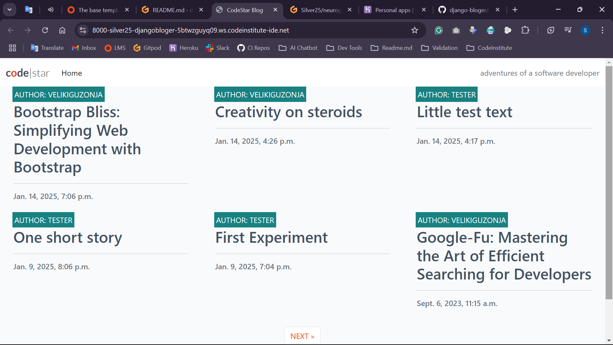

### IMG Accordion (collapsible content)

Responsive visual <b style="color: yellow;">(open here)</b>
  
<!-- Change code from  -->

  

  

- descriptive line as a bullet point
  
---
---

### last modifications
- xxx

---
---

**python manage.py runserver**  
**DEBUG: False, git add, commit and push**
  
  
### REGENERATE the 'SECRET_KEY' [settings.py] for final production deployment
- Terminal: **python -c 'import secrets; print(secrets.token_urlsafe(40))'**  [ prints lower, upper, numerical & special char ]
or  
- Terminal: **python -c 'from django.core.management.utils import get_random_secret_key; print(get_random_secret_key())'**
