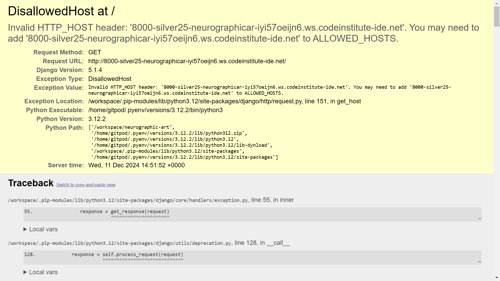
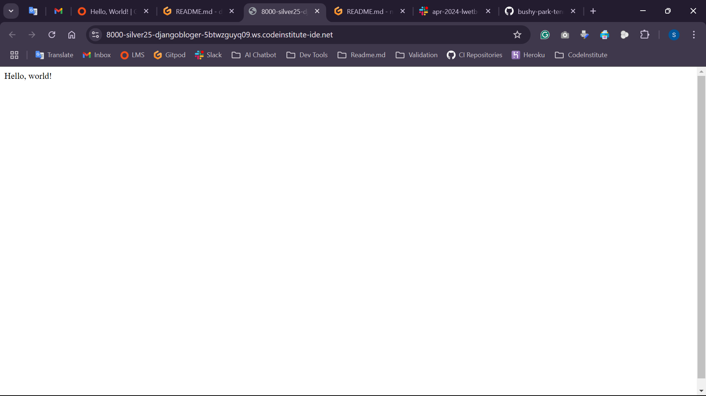
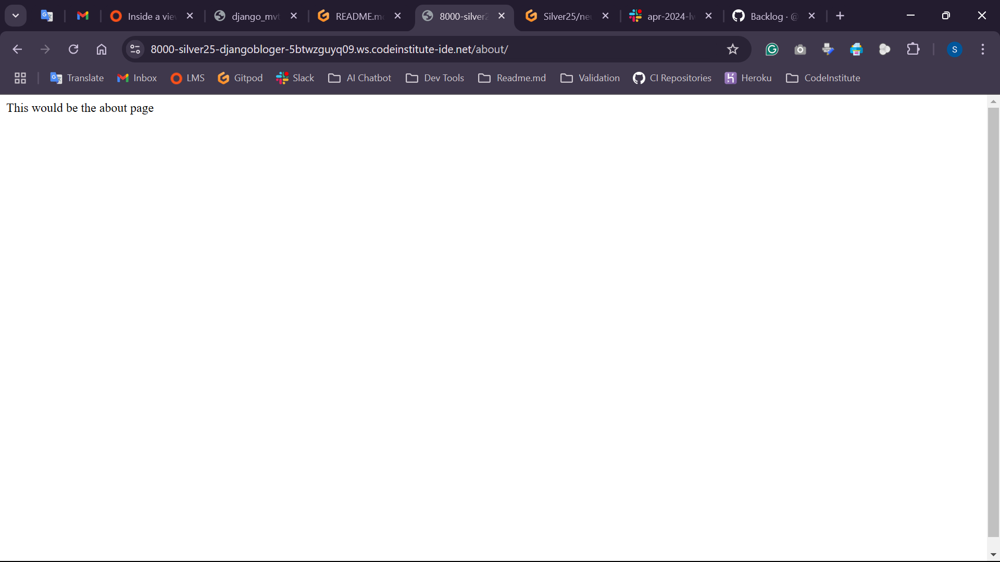
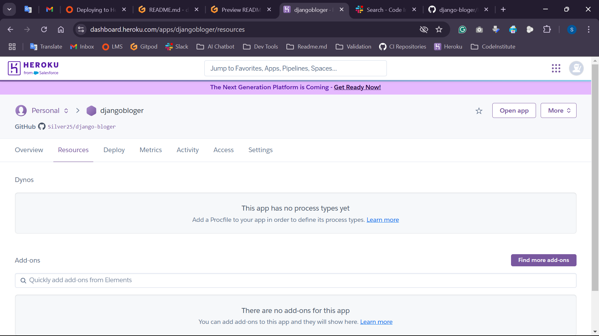
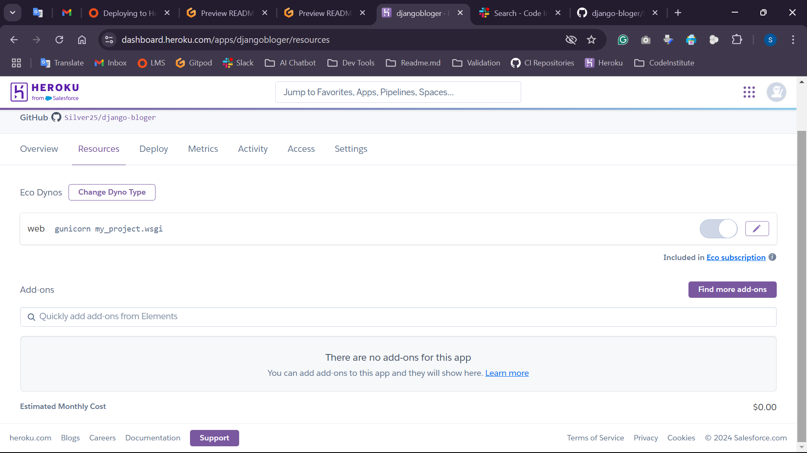

# Django Bloger

## Purpose

## Description [Interactive Responsive Website]

## UX Design
Proposed by Jesse James Garrett, this process is represented as five levels of activity called planes.  
These planes and their concerns are as follows.

### Target audience

### First Time Visitor Goals

### Returning Visitor Goals

### User Stories
- MoSCow prioritization [for PBIs - Product Backlog Items]:
- Must Have / Should Have / Could Have / Won’t Have (GitHub Issues)
- create user story template file [user-story.md]
- git pull to update preview on Gitpod VS GUI
- write these lines as reminder

### The strategy plane: 
What are you aiming to achieve in the first place and for whom?

### The scope plane: 
Which features, based on information from the strategy plane, do you want to include in your design?
What's on the table for a production release and what's not, at least for now?

### The structure plane: 
How is the information structured and how is it logically grouped?

### The skeleton plane: 
How will our information be represented, and how will the user navigate to the information and the features?

### The surface plane: 
What will the finished product look like?
What colors, typography, and design elements will we use?

### Wireframes

### Colour Scheme

### Typography

## Features

### Future Features

## Testing

### Manual Testing

### Validator Testing

### Bugs and Issues

## Deployment
Heroku deployment
- Front page -> Create new app
- App name + Europe -> Create app
- Dashboard -> Settings tab
- _Config Vars_ called `PORT`. Set this to `8000`
- Config Vars -> Reveal Config Vars -> CREDS + creds.json code
- Buildpacks -> Add buildpack -> Python + Node.js
- Deploy tab -> Deployment method -> GitHub -> Connect to GitHub -> Authorize Heroku
  -> Popup window -> Sign in to GitHub -> Search for gitHub project
- Manual deploy -> Deploy a GitHub branch -> Deploy Branch button
- Receive code from GitHub -> Build main ...
- Your app was successfully deployed. -> View button

## Technologies

## Credits [Acknowledgments]

Me, Myself and I
---
---

## Gitpod Reminders

To run a frontend (HTML, CSS, Javascript only) application in Gitpod: `python3 -m http.server`

To run a backend Python file, type `python3 app.py`.

By Default, Gitpod gives you superuser security privileges. Therefore, you do not need to use the `sudo` (superuser do) command in the bash terminal in any of the lessons.

To log into the Heroku toolbelt CLI:

1. Log in to your Heroku account and go to *Account Settings* in the menu under your avatar.
2. Scroll down to the *API Key* and click *Reveal*
3. Copy the key
4. In Gitpod, from the terminal, run `heroku_config`
5. Paste in your API key when asked

You can now use the `heroku` CLI program - try running `heroku apps` to confirm it works. This API key is unique and private to you, so do not share it. If you accidentally make it public, you can create a new one with _Regenerate API Key_.

### Connecting your Mongo database

- **Connect to Mongo CLI on a IDE**
- navigate to your MongoDB Clusters Sandbox
- click **"Connect"** button
- select **"Connect with the MongoDB shell"**
- select **"I have the mongo shell installed"**
- choose **mongosh (2.0 or later)** for : **"Select your mongo shell version"**
- choose option: **"Run your connection string in your command line"**
- in the terminal, paste the copied code `mongo "mongodb+srv://<CLUSTER-NAME>.mongodb.net/<DBname>" --apiVersion 1 --username <USERNAME>`
  - replace all `<angle-bracket>` keys with your own data
- enter password _(will not echo **\*\*\*\*** on screen)_

## Release History

- Terminal: pip3 install Django==5.1.4
- Terminal: pip3 freeze --local > requirements.txt
- Terminal: django-admin startproject my_project . [ creating the Django project ]
- Terminal: python3 manage.py runserver  
- [ for security reasons, Django doesn't recognise the hostname - the server name ]
- Solution: hostname link place in my_project/settings.py file - ALLOWED_HOSTS
- Terminal: python manage.py startapp hello_world  [ creating the app 'hello_world ]
- Creating Views in hello_world/views.py
- Creating URLs in my_project/urls.py
- Adding the app to the settings.py file to connect the app to the project  [ INSTALLED_APPS list ]
- Terminal: test/run app in browser  [  ]
- Terminal: python3 manage.py startapp about  [ creating the app 'about' ]
- Creating all necessary steps to activate and run app [ settings, urls, views ]
- Test/run app in browser  
- App can be seen if name of the app is applied on the end of the URL in address bar
- Create new Heroku app, djangobloger
- Install a production-ready webserver for Heroku, gunicorn==20.1.0, add to requirements file
- Create Procfile, with declaration command to execute Django project
- Add herokuapp.com to the ALLOWED_HOSTS list
- Can't activate Heroku EcoDynos, NO such option 
- After few minutes, refresh/change tab and was activated 