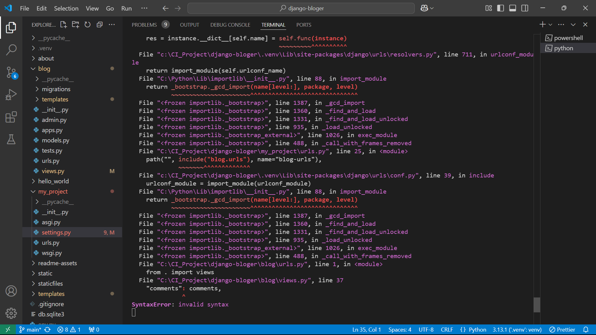

# Django Bloger

## Purpose

## Description [Interactive Responsive Website]

## UX [User Experience]

### Target audience

### First Time Visitor Goals

### Returning Visitor Goals

### User Stories
- MoSCow prioritization [for PBIs - Product Backlog Items]:
- Must Have / Should Have / Could Have / Won’t Have (GitHub Issues)
- create user story template file [user-story.md]
- git pull to update preview on Gitpod VS GUI
- write these lines as reminder

### The strategy plane: 
What are you aiming to achieve in the first place and for whom?

### The scope plane: 
Which features, based on information from the strategy plane, do you want to include in your design?
What's on the table for a production release and what's not, at least for now?

### The structure plane: 
How is the information structured and how is it logically grouped?

### The skeleton plane: 
How will our information be represented, and how will the user navigate to the information and the features?

### The surface plane: 
What will the finished product look like?
What colors, typography, and design elements will we use?

### Wireframes

- Database Schema - Entity Relationship Diagram [Generate Entity-Relationship diagrams for visual database design.]
  - To effectively generate database diagrams for PostgreSQL:

- DbSchema supports PostgreSQL and Community Edition offers a fantastic starting point
- pgAdmin is a widely used open-source administration and development platform
- DBeaver is a free, multi-platform database tool that supports PostgreSQL
- Navicat Premium Lite
- HeidiSQL is a lightweight, fast, and open-source tool for managing SQL Server databases.
- MySQL Workbench is the tool for developers working with MySQL databases.
- SQL Power Architect is a data modeling tool geared towards database architects
- DbVisualizer not provide diagramming or ER (Entity-Relationship) visualization features in its free edition.

### Colour Scheme

### Typography [Fonts]

## Features

- A custom 404 error page has been implemented to enhance the user experience when a page is not found. This page maintains the site's design and provides guidance to help users navigate back to valid sections of the website.

### Future Features

- Registered User with restricted access to Admin area to edit own posts/profiles

## Testing

### Manual Testing

- User Input/Form Validation
 - Navbar
 - Django messages
 - Register Page
 - Login Page
 - Logout Page
 - Comment Form
 - Edit Comment
 - Delete Comment
- Browser Compatibility
- Testing User Stories
- Responsive - Dev Tools

### Validator Testing

- https://validator.w3.org/ -> navigated to each page -> page source -> paste into the 'validate by input'
- https://jshint.com/ -> Comments.js
- https://pep8ci.herokuapp.com/
- Lighthouse in Incognito mode
- Wave [https://wave.webaim.org/)] is a suite of evaluation tools that helps authors make their web content more accessible to individuals with disabilities.

### Bugs and Issues
- **When Admin Logout from Admin area - also disconnect registered User which one is logged in?**
- **When User login and post comment - immediately Edit or Delete doesn't work?**
- SyntaxError raised after adding a code for displaying comments  

- Resolved the issue with enclosed parentheses around the code for the comment view.

## Deployment
- Connecting to Github
- Install Django
- Creating an App
- Create Necessary Folders
- Prerequisites Before Deploying to Heroku
- Database Setup (PostgreSQL)
- Cloudinary
- Deploying to Heroku
- IDE Workspace
- Clone Repo
- 

## Technologies

- Python
- Gitpod
- Github
- Google Apps

## Tools
- dbdiagram, free, simple tool to draw database diagrams (ERDs) by typing DSL code [https://dbdiagram.io/d]
- Visual Paradigm's online ERD software [https://online.visual-paradigm.com/diagrams/features/erd-tool/]
- Free AI ERD Diagram Maker [https://www.mymap.ai/er-diagram-tool]

## Credits [Acknowledgments]

DEV Community [https://dev.to/search?utf8=%E2%9C%93&q=visual+studio+code]
DEV Community [https://dev.to/search?utf8=%E2%9C%93&q=django]
---
---

## Release History

- Terminal: pip3 install Django==5.1.4
- Terminal: pip3 freeze --local > requirements.txt
- Terminal: django-admin startproject my_project . [ creating the Django project ]
- === name of the project in blog walkthrough: **'codestar'** ===
- Terminal: python3 manage.py runserver  
- [ for security reasons, Django doesn't recognise the hostname - the server name ]
- Solution: hostname link place in my_project/settings.py file - ALLOWED_HOSTS
- Terminal: python manage.py startapp hello_world  [ creating the app 'hello_world ]
- hello_world/views.py -> creating Views
- my_project/urls.py -> creating URLs
- settings.py -> adding the app to the file to connect the app to the project  [ INSTALLED_APPS list ]
- Terminal: test/run app in browser  
- Terminal: python3 manage.py startapp about  [ creating the app 'about' ]
- creating all necessary steps to activate and run app [ settings, urls, views ]
- test/run app in browser  
- app can be seen if name of the app is applied on the end of the URL in address bar
- create new Heroku app, 'djangobloger'
- Terminal: install a production-ready webserver for Heroku: "pip3 install gunicorn~=20.1"
- [ or for the last version: python -m pip install gunicorn]
- Terminal: pip3 freeze --local > requirements.txt  [ add to requirements file ]
- create 'Procfile', with declaration command to execute Django project
- settings.py -> add herokuapp.com to the ALLOWED_HOSTS list
- can't activate Heroku EcoDynos, NO such option 
- after few minutes, refresh/change tab and was activated 
- Terminal: pip3 install whitenoise~=6.5.0  [ Install Whitenoise package ]
- Terminal: pip3 freeze --local > requirements.txt  [ update requirements file ]
- GitHub, create new project [User stories] with issues as a part of my Repo
- start Blog walkthrough with new app = blog
- Terminal: python manage.py startapp blog  [ creating the app 'blog' ]
- settings.py -> add the new app to the list of installed apps in the file
- blog/views.py -> add an import for HttpResponse in the file
- blog/views.py -> add a function to return the text string "Hello, Blog!" in the file
- my_project/urls.py -> import the appropriate views file and add the new path ‘blog/’
- Terminal: test/run app in browser
- creating the Database [ PostgreSQL ] with CI manager
- env.py -> connecting database to code with file, hold db URL
- Install packages psycopg2 [ driver ] and dj-database-url for connection with db
- project/settings.py -> import the appropriate packages
- comment out local sqlite3 database connection [ created as default on setup ]

- Terminal: python3 manage.py createsuperuser
- create new class 'Post' with required dependencies in 'blog' app

- start the Django server, append /admin to the URL

- created new Post in Django Admin - using +Add button

- created new User in Django Admin - using +Add button

- created new model class 'Comment' with all dependencies in 'blog' app [ how model field names looks in Django!! ]

- build homepage with Django generic views and remove old about and blog urls

- Terminal: pip3 install django-summernote~=0.8.20.0 [Summernote, a robust text editor for Admin]
- add django-summernote~=0.8.20.0 to requirements.txt file
- codestar/settings.py -> append 'django_summernote', to the INSTALLED_APPS
- codestar/urls.py -> path('summernote/', include('django_summernote.urls')), to urlpatterns =
- blog/admin.py -> import the class SummernoteModelAdmin
- blog/admin.py -> add a class named PostAdmin
- blog/admin.py -> add an @admin.register(Post) decorator above the PostAdmin class
- blog/admin.py -> delete the existing Post model registration
- apply the migrations for the django_summernote app
- Terminal: python3 manage.py makemigrations
- Terminal: python3 manage.py migrate
- run the Django server and open Admin area
- adding more posts with 'fixtures' - Set of pre-written data for a database in the same format
- blog app - create new folder 'fixtures' and inside file 'posts.json', paste source code
- Terminal: load the data to the database table with 'python3 manage.py loaddata posts'
- add blog/fixtures/ to the .gitignore file  
- The base template and homepage
- codestar/settings.py -> create a TEMPLATES_DIR constant
- add newly created TEMPLATES_DIR constant to the list of 'DIRS'
- add a new top-level 'templates' directory and inside new 'base.html' file, filled with code
- add a new index.html file to existing app-level blog/templates/blog directory
- blog/views.py -> replace the existing template_name with the new template_name
- delete the redundant 'post_list.html' template, as is replaced with the new 'index.html' template
- create a top-level 'static' directory with a 'css' directory within it, and a style.css file
- codestar/settings.py -> and build a path for our subdirectory static
- base.html -> and load the static directory with 
- base.html -> add a link for custom CSS file

- apply new  to base.html and index.html
- add variable excerpt in index.html and tag URL in base.html files
- add tag if statement for PREV post list button in index.html
- Terminal: pip3 install whitenoise~=6.5.0
- add 'whitenoise.middleware.WhiteNoiseMiddleware', to settings.py
- create a staticfiles directory and collect the static files:
- settings.py -> STATIC_ROOT = os.path.join(BASE_DIR, 'staticfiles')
- Terminal: python3 manage.py collectstatic  [ command create a staticfiles dir and fill it with static files ]
- Terminal: python3 -V  [ check the IDE Python version ]
- add a runtime.txt file to projects root directory, add line: 'python-3.12' [ IDE supported Python version ]
- Heroku dashboard -> Settings tab -> Remove the DISABLE_COLLECTSTATIC key/value pair
- blog/urls.py -> new path for post_detail
- index.html -> template's for-loop [ to display posts ] update the anchor element
- blog/views.py -> add a 'post_detail' function-based view
- blog/views.py -> add the 'get_object_or_404' method to the import
- create an 'images' directory in the existing static directory and upload the image for the post header
- create a new 'post_detail.html' file in the 'blog/templates/blog' directory & fill with the code
- Terminal: python3 manage.py collectstatic [ collect the new static files to the staticfiles directory ]
- create HTTP error page 400, 403, 404 & 500
- settings.py -> add app 'about', into INSTALLED_APPS
- about/models.py -> class About(models.Model): ...
- Terminal: python3 manage.py makemigrations
- Terminal: python3 manage.py migrate
- about/admin.py -> import model '@admin.register(About)' and the SummernoteModelAdmin
- about/views.py -> add view queryset code 'def about_all(request):' = name will correlate with about/urls.py
- **blog/views.py -> 'get_object_or_404' method to the import, function** - do I need those lines in every app???
- templates/base.html -> create about_url variable [like the home_url] on top 
- templates/base.html -> add a link <li> to the navigation section of base.html
- in about app create templates/about directories
- about/templates/about -> create about.html file and fill it with code
- create a about/urls.py file and wire up view with a URL path
- project/urls.py -> import 'about.urls' to the urlpatterns path with a URL called about/
- static/images -> upload placeholder image for app/page about
- Error: placeholder image doesn't display on page if settings.py DEBUG: False
- **Heroku runs collectstatic, don't need to doing it on our own ??**
- Terminal: python3 manage.py collectstatic
- placeholder image displayed on about page
- setup of the project on localhost - 127.0.0.1:8000 [ Lenovo, instead of Gitpod service ]
- setup of the project on localhost - 127.0.0.1:8000 [ Dell, instead of Gitpod service ]
- Terminal: pip3 install django-allauth~=0.57.0  [Install the Allauth package]
- Terminal: pip3 freeze --local > requirements.txt  [Add the django-allauth package to the requirements.txt file]
- project/settings.py -> add the apps to INSTALLED_APPS
- project/settings.py -> add the constants directly below the INSTALLED_APPS
- project/settings.py -> append the command to the list of MIDDLEWARE
- project/settings.py -> add: ACCOUNT_EMAIL_VERIFICATION = 'none' [below the AUTH_PASSWORD_VALIDATORS]
- Terminal: python3 manage.py migrate  [only, just as with django_summernote do not need makemigrations]
- project/urls.py -> include the path of accounts in the urlpatterns
- base.html -> assign the new URLs to variables on the top
- base.html -> add Logout, Register and Login links, with their template tags
- Terminal: pip3 show django-allauth  [check the location of your django-allauth package files]
- Location: "c:\CI_Project\django-bloger\.venv\Lib\site-packages"
- Terminal: cp -r .venv/Lib/site-packages/allauth/templates/* ./templates/  [copy the allauth template files to 'templates']
- templates/account/login.html -> replace the code with CI code
- templates/account/logout.html -> replace the code with CI code
- templates/account/signup.html get changed related to system
- create some comments
- blog/views.py -> add the code to the post_detail view - WATCH OUT for parenthesis {"post": post,}
- blog/templates/blog/post_detail.html -> add code <!-- Displaying count of comments -->
- Terminal: pip3 install django-crispy-forms~=2.0 [install the package]
- Terminal: pip3 install crispy-bootstrap5~=0.7 [install the package]
- Terminal: pip3 freeze --local > requirements.txt [add package to file]
- project/settings.py -> add the crispy apps to INSTALLED_APPS
- even app are added to INSTALLED_APPS there are no migrations files to migrate in this instance
- codestar/settings.py, add the two constants
- add a new forms.py file to the blog app
- blog/forms.py -> add a form for comments into
- blog/views.py -> import the Comment form on the top
- blog/views.py -> post_detail view, create a variable comment_form, assign the class CommentForm()
- blog/templates/blog/post_detail.html -> load the crispy forms DTL tags
- post_detail.html -> add the comment form below the post and display comment loop
- blog/views.py -> add the form functionality within the post_detail view
- blog/views.py -> add an import for messages on the top
- blog/views.py -> within the post_detail view, add the code to display a success message string
- base.html > add the code to display Django messages
- test writing and submiting comment as a logged-in user
---
- **_New Crispy Form on About page = Subscribe-footer or Contact form**
- about/admin.py -> supplied code, copy-paste
- about/models.py -> supplied code, copy-paste
- about/templates/about/about_starter.html -> new file, supplied code, copy-paste
- Terminal: python manage.py makemigrations
- Terminal: python manage.py migrate
- about/forms.py -> import and code
- about/views.py -> import, function code
- about/templates/about.html -> load tag on top, form in body
- about/views.py -> import messages, function view
- Admin panel -> write the collab msg
- **_Editing and deleting records - CRUD**
- blog/views.py -> add the imports on the top
- blog/views.py -> add a new view 'comment_edit' at the bottom
- blog/urls.py -> create a URL to point to new 'comment_edit' view
- post_detail.html -> 'Edit' button code in template page
- static/js/comments.js -> create JavaScript to construct the edit comment URL, making the button functional
- post_detail.html -> add a DTL block with the script linking to the static/js/comments.js file
- base.html -> add a block with the same name at the end of the body element
- test with the login of user author of the comment that will be edited
- blog/views.py -> add a new 'comment_delete' view
- blog/urls.py -> add a urlpattern for new delete_comment view
- post_detail.html -> add a Delete button above the Edit button
- post_detail.html -> add a modal that opens on clicking Delete button for confirmation 
- static/js/comments.js -> add the constant and variables for the modal and two Delete button elements
- static/js/comments.js -> add the code below to construct the 'delete_comment' URL dynamically
- test the new functionality by running the Django server and opening the browser
---
- **_connect to the Cloudinary API_**
- Terminal: pip3 install cloudinary~=1.36.0
- Terminal: pip3 install dj3-cloudinary-storage~=0.0.6
- Terminal: pip3 install urllib3~=1.26.15  [ powerful, user-friendly HTTP client for Python ]
- Terminal: pip3 freeze --local > requirements.txt
- sign up for Cloudinary.com
- in the Cloudinary dashboard, open 'API Keys' and copy the CLOUDINARY_URL
- env.py -> os.environ.setdefault("CLOUDINARY_URL", "API URL copied from Cloudinary")
- env.py -> delete the CLOUDINARY_URL= from the start of the URL string
- codestar/settings.py -> add the 'cloudinary', ... apps to INSTALLED_APPS
- blog/models.py -> import the CloudinaryField from the 'cloudinary/models.py' file
- blog/models.py -> add a new field 'featured_image' to the Post model to store an image for each post
- Terminal: python manage.py makemigrations [as a new model field is added, create a new migrations file]
- Terminal: python manage.py migrate [the new blog migrations file make the changes to the database schema]
- blog/templates/blog/index.html -> add the if DTL loop code inside DIV class="image-container"
- index.html -> load tag for static in the template
- Heroku -> Reveal config vars -> add a CLOUDINARY_URL key:value pair from the env.py file
---
- **_Storing user-generated images_**
- In the admin panel, open the edit page for the blog post
- a new option for Post: a featured image. Upload an image and Save post.
- post_detail.html -> update code for the 'placeholder' image
- about/models.py -> add a new profile_image field using the CloudinaryFIeld class
- Terminal: run migrations after making the change to the model
- about.html -> set the template logic to display the existing nobody.jpg image if the default value is found. If not, display the uploaded profile image