# Django Bloger

## Purpose

## Description [Interactive Responsive Website]

## UX Design
Proposed by Jesse James Garrett, this process is represented as five levels of activity called planes.  
These planes and their concerns are as follows.

### Target audience

### First Time Visitor Goals

### Returning Visitor Goals

### User Stories
- MoSCow prioritization [for PBIs - Product Backlog Items]:
- Must Have / Should Have / Could Have / Won’t Have (GitHub Issues)
- create user story template file [user-story.md]
- git pull to update preview on Gitpod VS GUI
- write these lines as reminder

### The strategy plane: 
What are you aiming to achieve in the first place and for whom?

### The scope plane: 
Which features, based on information from the strategy plane, do you want to include in your design?
What's on the table for a production release and what's not, at least for now?

### The structure plane: 
How is the information structured and how is it logically grouped?

### The skeleton plane: 
How will our information be represented, and how will the user navigate to the information and the features?

### The surface plane: 
What will the finished product look like?
What colors, typography, and design elements will we use?

### Wireframes

### Colour Scheme

### Typography

## Features

### Future Features

## Testing

### Manual Testing

### Validator Testing

### Bugs and Issues

## Deployment
Heroku deployment
- Front page -> Create new app
- App name + Europe -> Create app
- Dashboard -> Settings tab
- _Config Vars_ called `PORT`. Set this to `8000`
- Config Vars -> Reveal Config Vars -> CREDS + creds.json code
- Buildpacks -> Add buildpack -> Python + Node.js
- Deploy tab -> Deployment method -> GitHub -> Connect to GitHub -> Authorize Heroku
  -> Popup window -> Sign in to GitHub -> Search for gitHub project
- Manual deploy -> Deploy a GitHub branch -> Deploy Branch button
- Receive code from GitHub -> Build main ...
- Your app was successfully deployed. -> View button

## Technologies

## Credits [Acknowledgments]

Me, Myself and I
---
---

## Gitpod Reminders

To run a frontend (HTML, CSS, Javascript only) application in Gitpod: **python3 -m http.server**

To run a backend Python file, type **python3 app.py**.

To run Django server, type: **python3 manage.py runserver**
Dev server opens: https://8000-silver25-djangobloger-5btwzguyq09.ws.codeinstitute-ide.net/
Heroku live server: https://djangobloger-fb8dc7f4bd37.herokuapp.com/

## Release History

- Terminal: pip3 install Django==5.1.4
- Terminal: pip3 freeze --local > requirements.txt
- Terminal: django-admin startproject my_project . [ creating the Django project ]
- === name of the project in blog walkthrough: **'codestar'** ===
- Terminal: python3 manage.py runserver  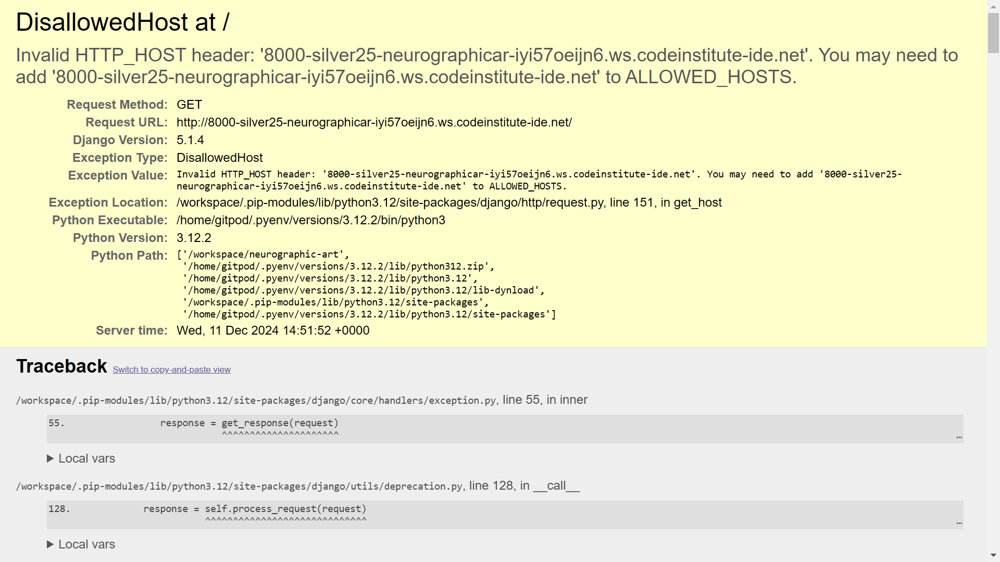
- [ for security reasons, Django doesn't recognise the hostname - the server name ]
- Solution: hostname link place in my_project/settings.py file - ALLOWED_HOSTS
- Terminal: python manage.py startapp hello_world  [ creating the app 'hello_world ]
- Creating Views in hello_world/views.py
- Creating URLs in my_project/urls.py
- Adding the app to the settings.py file to connect the app to the project  [ INSTALLED_APPS list ]
- Terminal: test/run app in browser  
- Terminal: python3 manage.py startapp about  [ creating the app 'about' ]
- Creating all necessary steps to activate and run app [ settings, urls, views ]
- Test/run app in browser  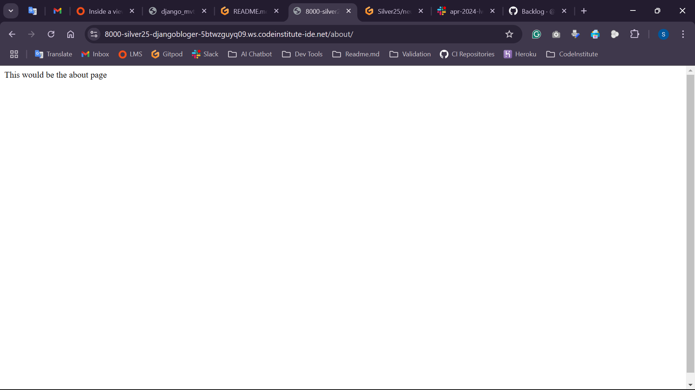
- App can be seen if name of the app is applied on the end of the URL in address bar
- Create new Heroku app, djangobloger
- Terminal: install a production-ready webserver for Heroku: "pip3 install gunicorn~=20.1"
- [ or for the last version: python -m pip install gunicorn]
- Terminal: pip3 freeze --local > requirements.txt  [ add to requirements file ]
- Create Procfile, with declaration command to execute Django project
- Add herokuapp.com to the ALLOWED_HOSTS list
- Can't activate Heroku EcoDynos, NO such option 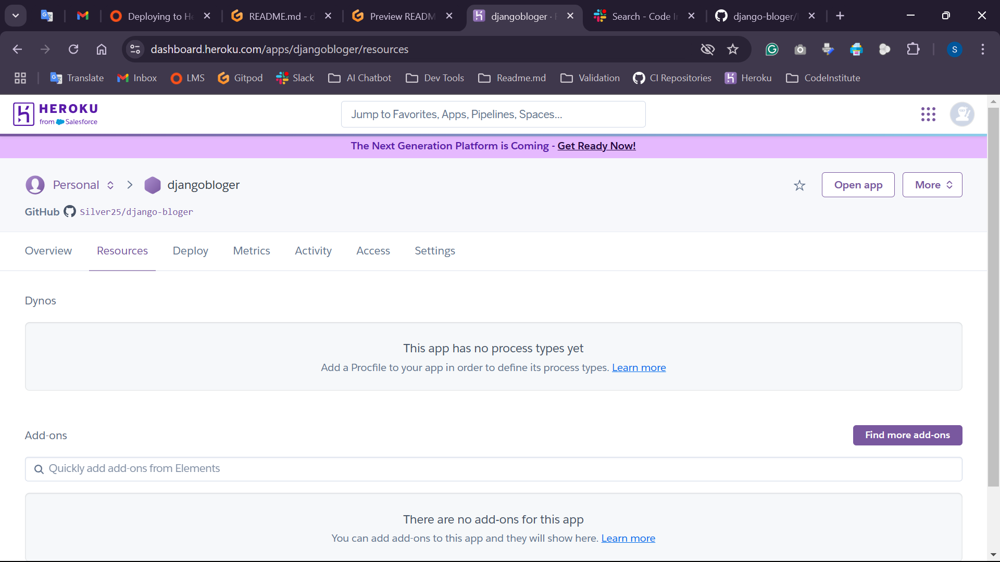
- After few minutes, refresh/change tab and was activated 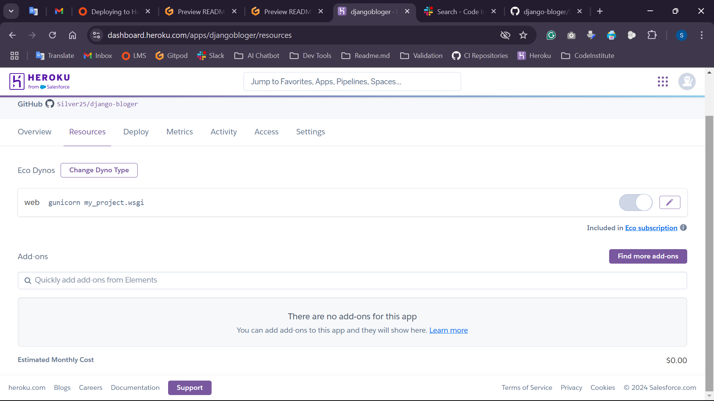
- Terminal: pip3 install whitenoise~=6.5.0  [ Install Whitenoise package ]
- Terminal: pip3 freeze --local > requirements.txt  [ update requirements file ]
- GitHub, create new project [User stories] with issues as a part of my Repo
- Start Blog walkthrough with new app = blog
- Terminal: python manage.py startapp blog  [ creating the app 'blog' ]
- Add the new app to the list of installed apps in the settings.py file
- Add an import for HttpResponse in the blog/views.py file
- Add a function to return the text string "Hello, Blog!" in the blog/views.py file
- Import the appropriate views file and add the new path ‘blog/’ in my_project/urls
- Terminal: test/run app in browser
- Creating the Database [ PostgreSQL ]
- Connecting database to code with env.py file, hold db URL
- Install packages psycopg2 [ driver ] and dj-database-url for connection with db
- Import the appropriate packages in project/settings.py
- Comment out local sqlite3 database connection [ created as default on setup ]
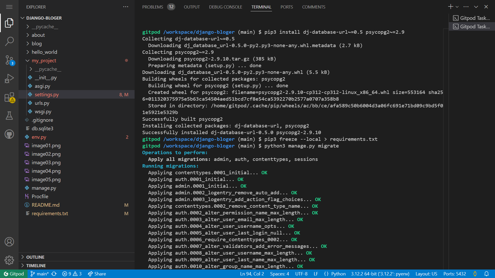
- Terminal: python3 manage.py createsuperuser
- Create new class 'Post' with required dependencies in 'blog' app
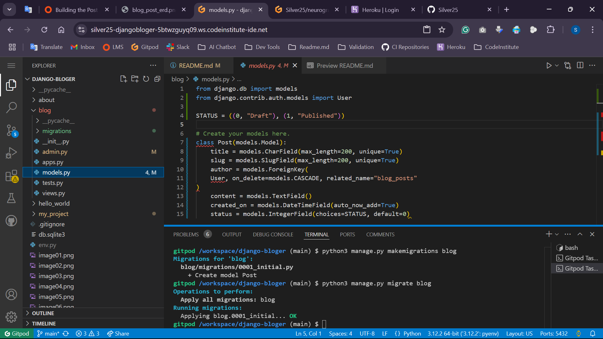
- Start the Django server, append /admin to the URL
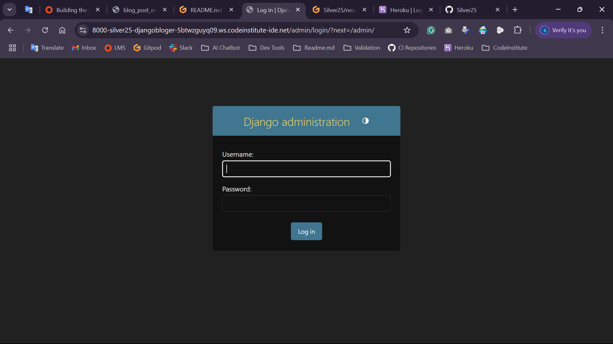
- Created new Post in Django Admin - using +Add button
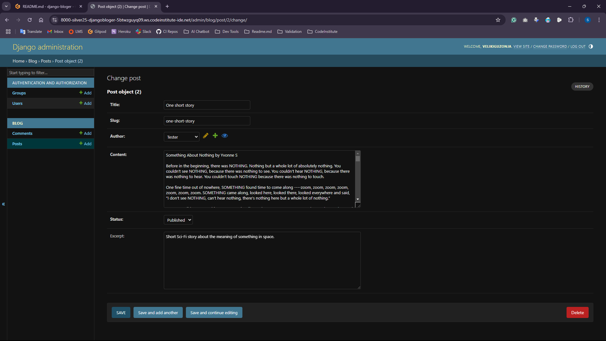
- Created new User in Django Admin - using +Add button
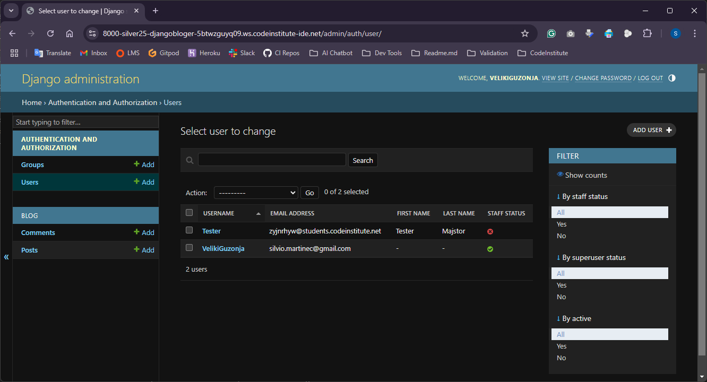
- Created new model class 'Comment' with all dependencies in 'blog' app [ how model field names looks in Django!! ]
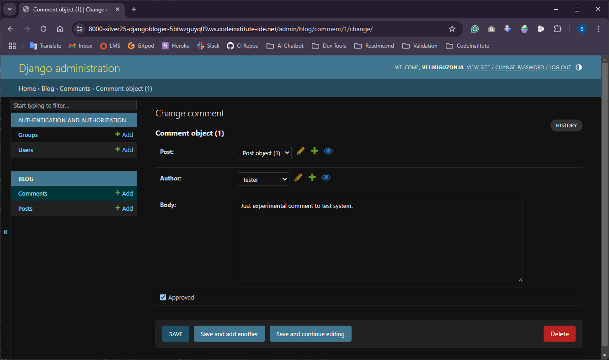
- Build homepage with Django generic views and remove old about and blog urls
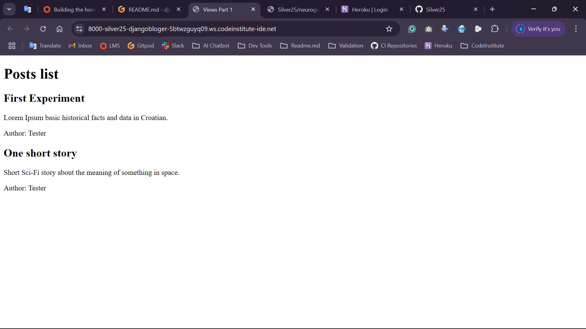
- Terminal: pip3 install django-summernote~=0.8.20.0 [Summernote, a robust text editor for Admin]
- Add django-summernote~=0.8.20.0 to requirements.txt file
- codestar/settings.py -> append 'django_summernote', to the INSTALLED_APPS
- codestar/urls.py -> path('summernote/', include('django_summernote.urls')), to urlpatterns =
- blog/admin.py -> import the class SummernoteModelAdmin
- blog/admin.py -> add a class named PostAdmin
- blog/admin.py -> add an @admin.register(Post) decorator above the PostAdmin class
- blog/admin.py -> delete the existing Post model registration
- Apply the migrations for the django_summernote app
- Terminal: python3 manage.py makemigrations
- Terminal: python3 manage.py migrate
- Run the Django server and open Admin area

### 17/01 actions
- Adding more posts with 'fixtures' - Set of pre-written data for a database in the same format
- Blog app - create new folder 'fixtures' and inside file 'posts.json', paste source code
- Terminal: load the data to the database table with 'python3 manage.py loaddata posts'
- Add blog/fixtures/ to the .gitignore file  

- The base template and homepage
- codestar/settings.py -> create a TEMPLATES_DIR constant
- Add newly created TEMPLATES_DIR constant to the list of 'DIRS'
- Add a new top-level 'templates' directory and inside new 'base.html' file, filled with code
- Add a new index.html file to existing app-level blog/templates/blog directory
- blog/views.py -> replace the existing template_name with the new template_name
- Delete the redundant 'post_list.html' template, as is replaced with the new 'index.html' template
- Create a top-level 'static' directory with a 'css' directory within it, and a style.css file